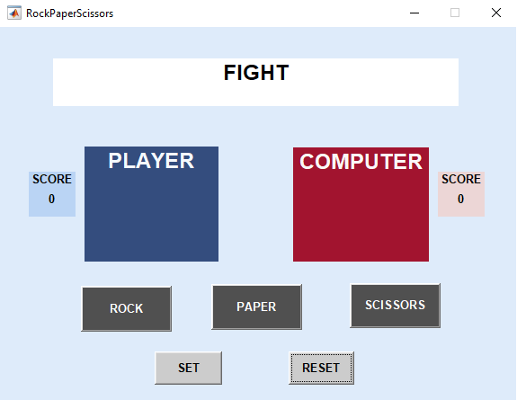
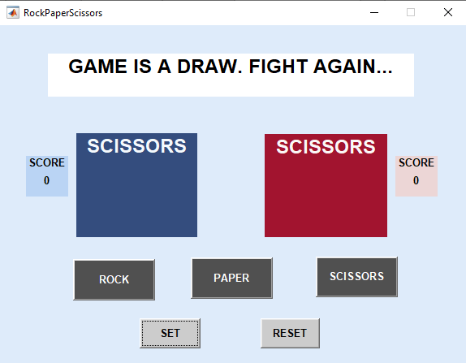
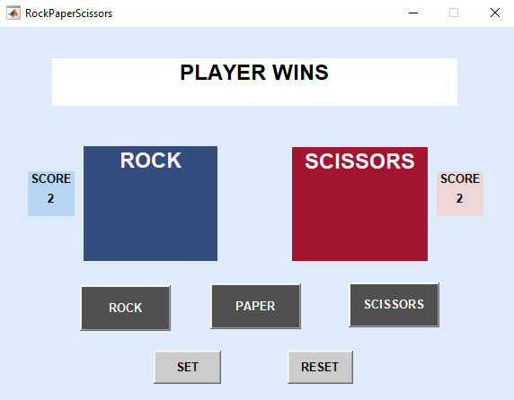

# Rock-Paper-Scissors-Matlab
Rock paper scissors game with Matlab

I have developed The rock paper scissors game with Matlab. You are playing with the machine which chooses its action randomly.

## Setup:
Go to the repository directory and type the RockPaperScissors in the command window.

<h3>Brief look at the game</h3>

Game has started, fight:
 
 

Both player and computer have chosen scissors:
 

 

Rock beats the scissors:
 

 
